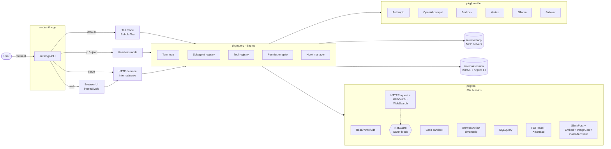
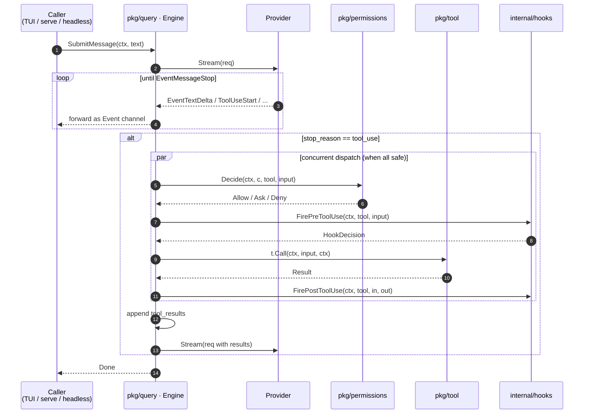
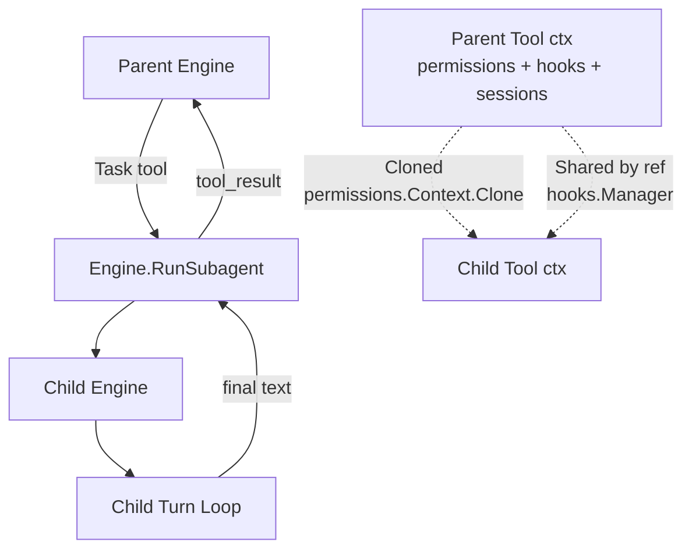
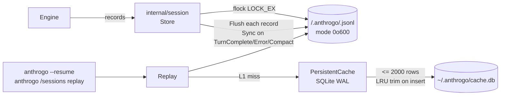
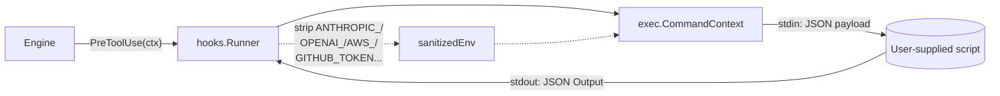
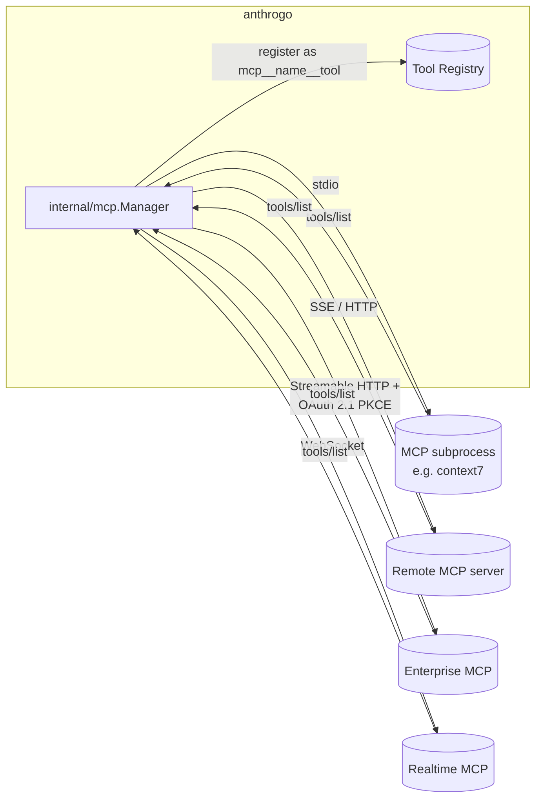

# Architecture

This page sketches anthrogo's runtime topology and how the major packages
fit together. For per-package API details see the [API reference](api/).

## Top-level: one binary, four entry modes

## Engine turn loop

## Subagent dispatch (M5.1+)

For KAIROS (cross-process subagent dispatch) see [docs/kairos.md](kairos.md).

## Session storage

## Hook flow

## MCP topology

## Permission gate

The gate is the single point of decision for every tool invocation. Order
documented in `pkg/permissions/gate.go::Decide`:

1. `ModeBypassPermissions` + `IsBypassAvailable` → allow always.
2. Deny rules win unconditionally.
3. `ModeAcceptEdits` auto-allows `Write` / `Edit` / `NotebookEdit`.
4. `HookDecide(ctx, tool, input)` may short-circuit Allow / Deny / Pass.
5. Allow rules → allow (plan mode still locks write tools).
6. Ask rules → ask (or deny if `ShouldAvoidPrompts`).
7. Fallback → ask in default mode, deny in `ShouldAvoidPrompts`.
